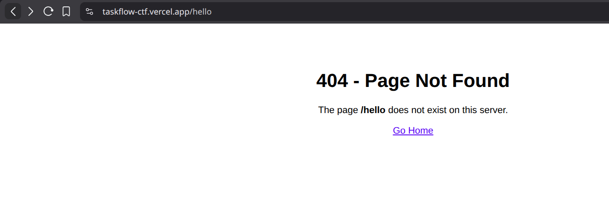
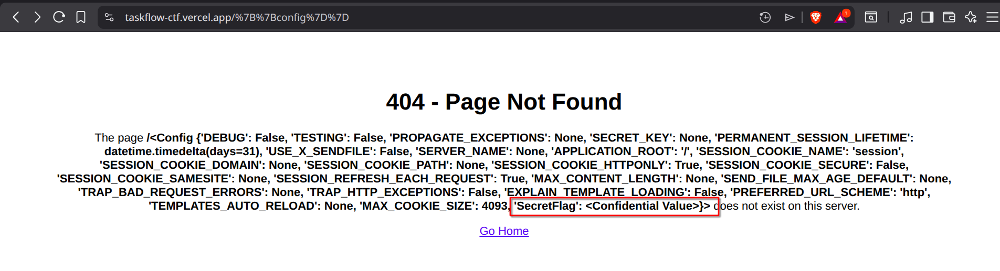
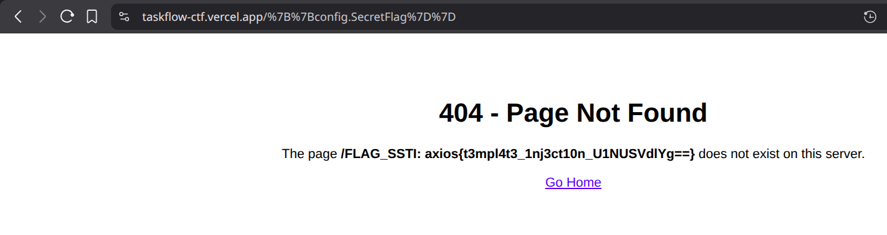

# 🚩 TaskFlow CTF: Solution Writeup

## 1. TaskFlow: Control Urself

**Category:** Web Exploitation / Recon

### Description
 The developer dave seems careless and he comments on us. Can you find the flag they left during development?!?!

Website: [https://taskflow-ctf.vercel.app/](https://taskflow-ctf.vercel.app/)

### Solution
There are several hints("he *comments* on us", "left during development", "*Control U*rself) which are indicating that the flag must be hidden in comments in between code, and shortcut `Ctrl+U` can be used to see the source code indicated by the challenge name. 
Srolling thorugh the source code, the flag is in the comments.

### Flag
```
axios{c0mm3nts_4r3_n0t_h1dd3n_aW5zcGVjdFdlYg==}
```

---

## 2. TaskFlow: Mr. Roboto

**Category:** Web / Standards

### Description
Search engines are great, but sometimes we don't want them looking at our secret files.

Website: [https://taskflow-ctf.vercel.app/](https://taskflow-ctf.vercel.app/)

### Solution
There are many type of secret files(robots.txt, sitemap.xml, humans.txt, backup.zip) a website has. Checking all can be a lot, checking for any more hint, the challenge name says *Mr roboto*, so most probably the file is `robots.txt`. On appending `/robots.txt` to url, found the flag.

### Flag
```
	
axios{r0b0ts_txt_is_n0t_s3cur1ty_cm9ib3RzV2Vi}
```

---

## 3. TaskFLow: Admin Loves Cookies

**Category:** Broken Access Control (BAC)

### Description
I can log in as a user, but the Admin panel says `Access Denied`.

Website: [https://taskflow-ctf.vercel.app/admin](https://taskflow-ctf.vercel.app/admin)

### Vulnerability Analysis
The description is saying to access as admin but we can only login as user. On checking the `Admin Panel` it says `Access Denied`. The challenge name says *admin loves cookies*, so lets check cookies. Logging In then opOpen Developer Tools → **Application / Storage**. The `role` cookie has value `dXNlcg==`, which seems to be base64, which can be decrypted using [Cyberchef](https://gchq.github.io/CyberChef/) or if want to identify first then can use [dcode.fr](https://www.dcode.fr/cipher-identifier); it is decrpyted as `user`. So we can put `admin` at that place in base64,`YWRtaW4=`. After replacing the cookie value then refreshing the page. Got access to `/admin` page (Admin Panel) and got the flag. 

### Flag
```
axios{br0k3n_4cc3ss_c0ntr0l_QkFDV2Vi}
```

---

## 4. TaskFlow: Not Found

**Category:** Server-Side Template Injection (SSTI)

### Description
"The 404 page echoes your input. Maybe it’s vulnerable?"

### Vulnerability Analysis
The `/404` page looks normal at first glace. But description says its not. So changing the url with something random instead of `/404`, like `/hello` gives follwing output on the page. 



So trying some basic injection instead of `/hello`, `/{{7*7}}` → returns `49`. 

 

It confirms Template injection is working. Trying some basic injection(flag, config). `/{{config}}` resulted in something maybe important.



Now, lets find the flag by passing the element to the object by `{{config.SecretFlag}}`



Got the flag

### Flag
```
	
axios{t3mpl4t3_1nj3ct10n_U1NUSVdlYg==}
```

---

## 5. Challenge: Peeping

**Category:** Insecure Direct Object Reference (IDOR)

### Description

Try 

`user: bob`

`password: bob123`

Do you think, something in the url looks fishy🐠???

Website: [https://taskflow-ctf.vercel.app/](https://taskflow-ctf.vercel.app/)

### Vulnerability Analysis
Logging in with given credentials. Then checking the url, the application uses a `uid` parameter without validating user authorization. So change the parameter to `uid=0`. View the admin’s task list. Got the flag.

### Flag
```
axios{1d0r_ch@ll3ng3_SURPUldlYg==}
```

---

## 6. Challenge: Calculated Risk

**Category:** PyJail / Sandbox Escape

### Description
We added a new "Safe" calculator. It has a strict firewall to prevent hackers from stealing our secrets.

Website: [https://taskflow-ctf.vercel.app/calculator](https://taskflow-ctf.vercel.app/calculator)

### Vulnerability Analysis
The calculator blocks keywords but may reveal by using some keyword(flag, globals(), etc). `globals()` gave big pile of text, going through it reveals `SUPER_SECRET_FLAG_6` but with confidential value. Providing the input    `globals()['SUPER_SECRET_FLAG_6']` blocks it. Trying with breaking the string  `globals()['SUPER_SECRET_FL' + 'AG_6']` gives the flag.


### Flag
```
axios{pyth0n_m4st3r_byp4ss_UHlKYWlsV2Vi}
```

---
